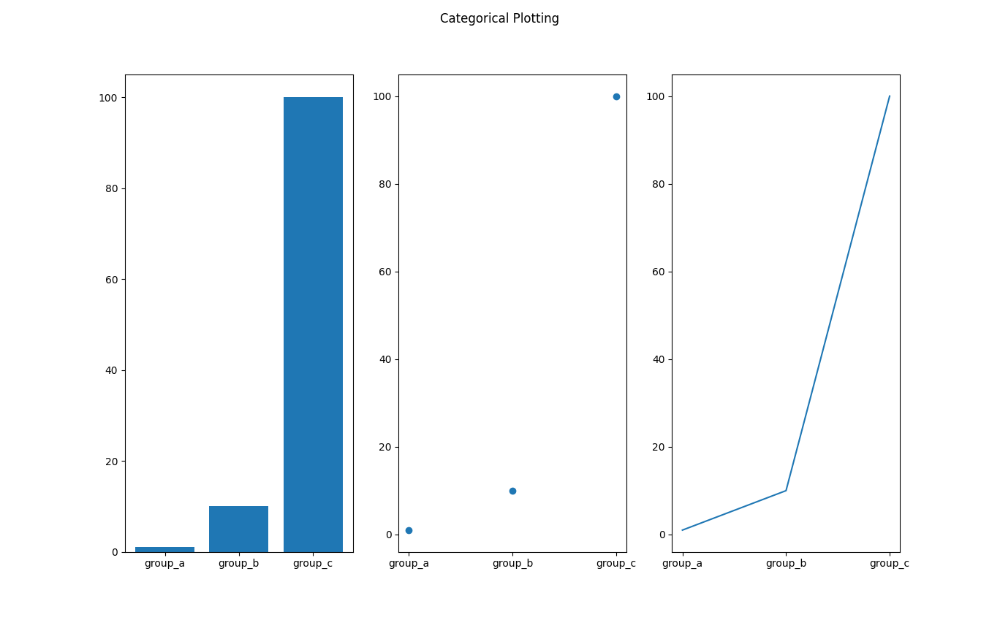

ex00: Example provided by matplotlib developers
-----------------------------------------------

*This is the first provided example in the 
[matplotlib tutorial](https://matplotlib.org/stable/tutorials/introductory/pyplot.html#sphx-glr-tutorials-introductory-pyplot-py) illustrating bar graphs*

 [(py)](plotEx00.py)

plotEx01.py

plotEx02.py
plotEx02a.png

plotEx03.py
plotEx03a.png

plotEx04.py
plotEx04a.png

procHospital8.csv
procHospital8a.csv
procHospital9.csv
