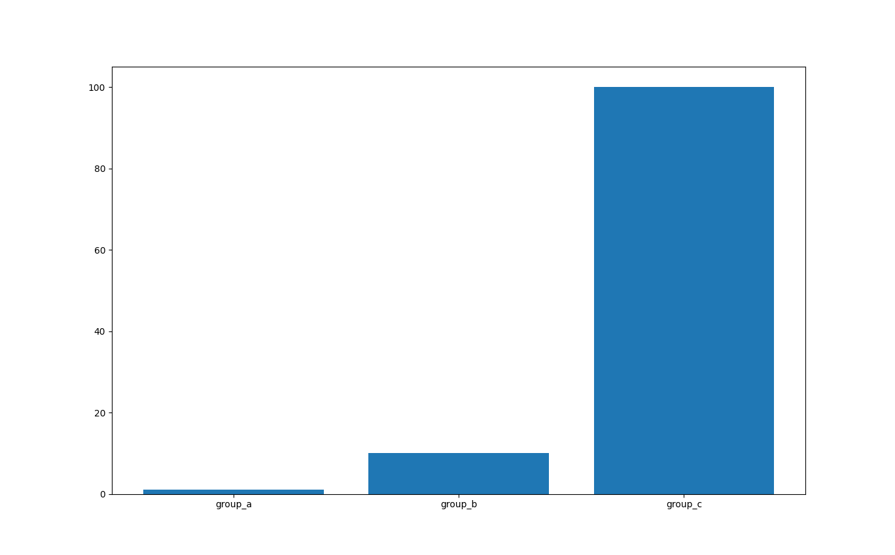

 [(py)](plotEx00.py)
**ex00: Example provided by matplotlib developers**
*This is the first provided example in the 
[matplotlib tutorial](https://matplotlib.org/stable/tutorials/introductory/pyplot.html#sphx-glr-tutorials-introductory-pyplot-py) illustrating bar graphs*

 [(py)](plotEx01.py)
**ex01: Extraction of bar graph alone**

 [(py)](plotEx02.py)
**ex02: **

 [(py)](plotEx03.py)
**ex03: **

 [(py)](plotEx04.py)
**ex04: **

procHospital8.csv
procHospital8a.csv
procHospital9.csv
